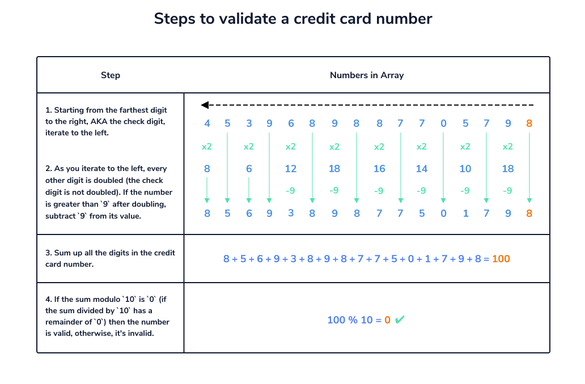

<p align="center">
<a href="https://www.linkedin.com/in/ahmet-ayd%C4%B1n-2583b1199/" target="_blank"></a>
</p>


# Credit Card Checker Project


## Table of contents

- [Overview](#overview)
  - [The challenge](#the-challenge)
  - [Screenshot](#screenshot)
  - [Links](#links)
- [My process](#my-process)
  - [Built with](#built-with)
  - [What I learned](#what-i-learned)
  - [Continued development](#continued-development)
  - [Useful resources](#useful-resources)
- [Author](#author)


## Overview
I used Luhn Algorithm to check credit cards.
<a href="https://en.wikipedia.org/wiki/Luhn_algorithm#Description">Luhn Algorithm</a>

### The challenge

Users should be able to:

- Check if their credit card is valid or not.
- See hover states for all interactive elements on the page

### Screenshot

<p align="center">
<a href="https://bavi-boop.github.io/credit-card-checker-js/"></a>
</p>

## Project Skeleton 

```

|----credit-cards(folder)
     |----images..
    
|----main.js  
|----style.css
|----index.html
```

### Links

- [live site URL here: ([Live Website)](https://bavi-boop.github.io/credit-card-checker-js/)

## My process

### Built with

- Semantic HTML5 markup
- CSS custom properties
- Flexbox
- CSS Grid
- JavaScript HTML DOM
- Google Specific Fonts
- Mobile-first workflow

- [Styled Components](https://styled-components.com/) - For styles


### What I learned

I learned how to use DOM manipulation , javascript DOM manipulation, flexboxes, media queries, html elements and many more.

To see how you can add code snippets, see below:

```Javascript
<h1>Some JS code I'm proud of</h1>
function validateCred(numbers) {
  let numArr = numbers.join("").split("")
  let total = 0;
  for (let i = numArr.length - 1; i >= 0; i--) {
    let currValue = Number(numArr[i])
    if ((numArr.length - 1 - i) % 2 === 1) {
      currValue *= 2;
      if (currValue > 9) {
        currValue -= 9;
      }
    }
    total += currValue;
  }

  return total % 10 === 0;

}
```
```css
.proud-of-this-css {
     #money {
      /*  set start position */
      transform: translateY(11.25rem);
      transition: transform 0.1s ease-in-out;
      /*  set transition for mouse enter & exit */
    }
  
    button:hover #creditcard {
      transform: translateY(0px);
      transition: transform 0.2s ease-in-out;
      /*  overide transition for mouse enter */
    }
  
    button:hover #money {
      transform: translateY(0px);
      transition: transform 0.3s ease-in-out;
      /*  overide transition for mouse enter */
    }
}
```
```js
const proudOfThisFunc = () => {
      <div class="meta-container last">
}
```


### Continued development

I will build backend and extra pages for this website in the future . Also I will also add google adverts to this webpage.

**Note: Delete this note and the content within this section and replace with your own plans for continued development.**

### Useful resources

- [W3 Schoold](https://www.w3schools.com/) - This helped me for basics of website paradigm. I really liked this pattern and will use it going forward.
- [MDN](https://developer.mozilla.org/en-US/) - This is an amazing document which helped me finally understand deep sides of web development. I'd recommend it to anyone still learning these concepts.
- [Similar Website](https://www.validcreditcardnumber.com//) - A similar website that validates credit cards.


## Author

- Author - [Ahmet]

